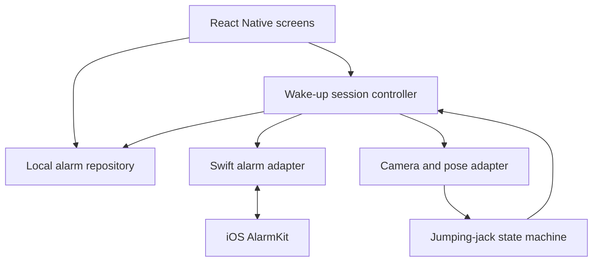

# MovementAlarmClock

An iPhone alarm app with a movement challenge: get out of bed, stand in view of the camera, and complete **five jumping jacks** to finish your wake-up session.

**Status:** planning and architecture only. The app, native integrations, tests, CI/CD workflows, and scheduled coding task are not implemented yet. Everything below describes the intended design.

## MVP

- Create, edit, enable, disable, and delete alarms with local-time schedules.
- Open a movement challenge from the alarm experience.
- Show camera positioning guidance and progress from 0/5 to 5/5.
- Count complete jumping jacks using on-device pose landmarks.
- Persist alarm settings locally and work without an account or backend.
- Provide an explicit fallback when camera access or movement is unavailable.

Android, accounts, leaderboards, subscriptions, and additional exercises are outside the first two-week scope.

## iPhone feasibility comes first

The product goal is movement-based dismissal, but **we cannot promise an alarm that is impossible to stop without exercising**. Apple's AlarmKit includes system-managed stop controls. Completing the in-app challenge and stopping a system alarm must be tracked as separate events.

Before building the full experience, test a native alarm prototype on a physical iPhone: scheduling, lock-screen delivery, opening the app, system dismissal, and what happens when the app is backgrounded or terminated. Document the supported iOS version and observed behavior. If strict movement-gated dismissal is not supported, ship an honestly described alarm plus wake-up challenge, with the limitation visible in onboarding.

## Proposed stack

| Layer | Initial choice | Purpose / decision gate |
| --- | --- | --- |
| App | React Native, TypeScript, Expo development build | Screens and shared application logic; custom native modules require a development build |
| Navigation | Expo Router | Alarm list, editor, challenge, and settings |
| Alarm integration | Swift module wrapping AlarmKit | Native scheduling and lifecycle events; confirm availability and supported iOS target in the prototype |
| Camera / pose | Native camera and on-device pose adapter | Evaluate an iOS-compatible detector in the prototype before selecting a package |
| Movement logic | Pure TypeScript state machine | Count complete repetitions independently of camera libraries |
| Persistence | Local storage behind a typed repository | Store schedules and settings; reconcile saved records with native alarm state |
| Validation | Jest and React Native Testing Library, plus native/device checks | Exercise rules, UI behavior, and platform integration |
| Delivery | GitHub Actions and Expo EAS | Automated checks and signed iOS test builds |

Package versions and native compatibility will be pinned when the app is scaffolded. Expo Go is not the target runtime for the native alarm prototype. No GPT API is needed inside the app; ChatGPT/Codex assists development.

## System architecture

### Responsibilities and data flow

1. The alarm editor validates input, requests permission when needed, schedules through the native adapter, and stores the native identifier. A failed schedule is shown as a failure, never as an active alarm.
2. On launch or resume, the app reconciles saved alarms with native state so edits, cancellations, and system dismissals do not leave stale UI.
3. Opening a challenge creates one session for the alarm occurrence. Duplicate callbacks must not create duplicate sessions.
4. Camera frames stay on the device. The pose adapter emits normalized landmarks, confidence, and timestamps; the counter consumes those values rather than raw video.
5. A completed session records its result and requests an alarm stop if still applicable. System dismissal alone never marks five reps as completed.

### Counting a jumping jack

The initial rule is **closed → open → closed = one rep**, after establishing a stable closed starting pose. Closed means arms down and feet together; open means arms raised and feet apart. Thresholds should be relative to body size and calibrated on a real device.

Use confidence thresholds, separate entry/exit thresholds, and a minimum stable duration to avoid jitter. Partial motions, repeated open frames, and stale frames must not add reps. Losing the person from view resets the unfinished rep while preserving completed reps. At five reps, complete the session once and stop counting.

### Proposed records

| Record | Fields |
| --- | --- |
| Alarm | ID, local time, repeat weekdays, enabled flag, native ID, scheduling status |
| Wake-up session | ID, alarm occurrence ID, start time, rep count, outcome, end time |
| Settings | Movement target (MVP: 5), onboarding state, permission guidance |

Keep system alarm status separate from challenge outcomes: `completed`, `abandoned`, or `fallback`. Store no raw camera frames. Define timezone travel, daylight-saving changes, and repeat scheduling behavior before enabling recurring alarms.

## Proposed source layout

| Path | Responsibility |
| --- | --- |
| `app/` | Routes and screens |
| `src/features/alarms/` | Alarm editing, validation, and reconciliation |
| `src/features/challenge/` | Session controller and challenge UI |
| `src/domain/movement/` | Pure repetition logic and landmark fixtures |
| `src/storage/` | Local persistence and schema migrations |
| `modules/` | Native alarm and pose integrations |
| `docs/` | Device findings and implementation decisions |
| `.github/workflows/` | CI and build orchestration |

These paths are planned; they do not exist yet.

## Technical references

- [Apple: scheduling an alarm with AlarmKit](https://developer.apple.com/documentation/alarmkit/scheduling-an-alarm-with-alarmkit)
- [Apple: alarm alert presentation and system stop control](https://developer.apple.com/documentation/alarmkit/alarmpresentation/alert-swift.struct)
- [Expo: adding custom native code](https://docs.expo.dev/workflow/customizing/)
- [Expo: CI/CD introduction](https://docs.expo.dev/tutorial/cicd/introduction/)
