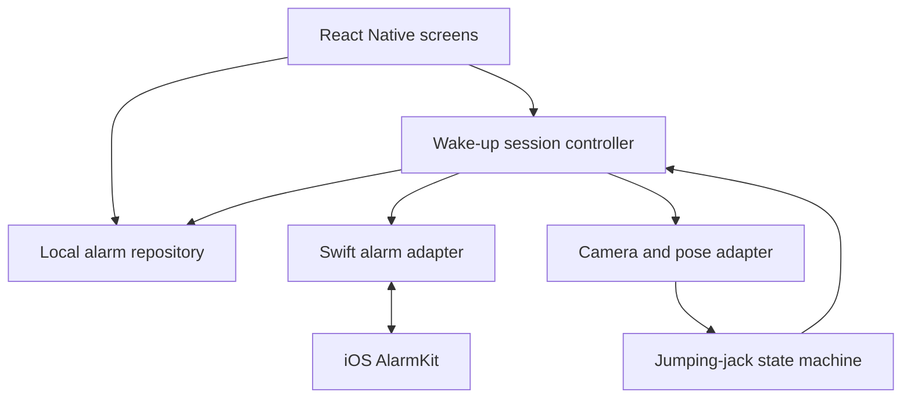

# MovementAlarmClock

An iPhone alarm app with a movement challenge: get out of bed, stand in view of the camera, and complete **five jumping jacks** to finish your wake-up session.

**Status:** The Expo/TypeScript foundation, a pure TypeScript jumping-jack counter, and a validated alarm model with versioned local-file persistence are in place. The alarm list/editor can create, reload, edit, and delete saved wake-up plans, but every record remains explicitly off and unscheduled. Recurring wall-clock behavior now has a deterministic [timezone and daylight-saving policy](docs/scheduling-policy.md), but it is not connected to native scheduling. The challenge preview has accessible progress and explicit denied, unavailable, interrupted, retry, Settings, and non-camera fallback states, but no camera permission or live frames are connected. A tested [wake-up session lifecycle](docs/session-lifecycle.md) deduplicates occurrence callbacks and separates system stop, movement completion, abandonment, and fallback. Its versioned repository preserves validated sessions and occurrence identity across repository reloads, and a dependency-injected controller now translates ready pose frames and recovery actions into persisted session events. The controller is not instantiated by the app route or connected to camera or AlarmKit adapters, and it has not been exercised on an iPhone. The counter is covered by deterministic synthetic-pose tests, but its thresholds are not calibrated on a person or device. Native alarms and camera/pose integration are not implemented. The app does not ring alarms yet. See [implementation progress and validation evidence](docs/progress.md).

## MVP

- Create, edit, enable, disable, and delete alarms with local-time schedules.
- Open a movement challenge from the alarm experience.
- Show camera positioning guidance and progress from 0/5 to 5/5.
- Count complete jumping jacks using on-device pose landmarks.
- Persist alarm settings locally and work without an account or backend.
- Provide an explicit fallback when camera access or movement is unavailable.

Android, accounts, leaderboards, subscriptions, and additional exercises are outside the first two-week scope.

## iPhone feasibility comes first

The product goal is movement-based dismissal, but **we cannot promise an alarm that is impossible to stop without exercising**. Apple's AlarmKit includes system-managed stop controls. Completing the in-app challenge and stopping a system alarm must be tracked as separate events.

Before building the full experience, test a native alarm prototype on a physical iPhone: scheduling, lock-screen delivery, opening the app, system dismissal, and what happens when the app is backgrounded or terminated. Document the supported iOS version and observed behavior. If strict movement-gated dismissal is not supported, ship an honestly described alarm plus wake-up challenge, with the limitation visible in onboarding.

## Proposed stack

| Layer             | Initial choice                                                   | Purpose / decision gate                                                                                |
| ----------------- | ---------------------------------------------------------------- | ------------------------------------------------------------------------------------------------------ |
| App               | React Native, TypeScript, Expo development build                 | Screens and shared application logic; custom native modules require a development build                |
| Navigation        | Expo Router                                                      | Alarm list, editor, challenge, and settings                                                            |
| Alarm integration | Swift module wrapping AlarmKit                                   | Native scheduling and lifecycle events; confirm availability and supported iOS target in the prototype |
| Camera / pose     | Native camera and on-device pose adapter                         | Evaluate an iOS-compatible detector in the prototype before selecting a package                        |
| Movement logic    | Pure TypeScript state machine                                    | Count complete repetitions independently of camera libraries                                           |
| Persistence       | Local storage behind a typed repository                          | Store schedules and settings; reconcile saved records with native alarm state                          |
| Validation        | Jest and React Native Testing Library, plus native/device checks | Exercise rules, UI behavior, and platform integration                                                  |
| Delivery          | GitHub Actions and Expo EAS                                      | Automated checks and signed iOS test builds                                                            |

Package versions are pinned in `package.json` and `package-lock.json`; native build and device compatibility still require validation. Expo Go is not the target runtime for the native alarm prototype. No GPT API is needed inside the app; ChatGPT/Codex assists development.

## System architecture



### Responsibilities and data flow

1. The alarm editor validates input, requests permission when needed, schedules through the native adapter, and stores the native identifier. A failed schedule is shown as a failure, never as an active alarm.
2. On launch or resume, the app reconciles saved alarms with native state so edits, cancellations, and system dismissals do not leave stale UI.
3. Opening a challenge creates one session for the alarm occurrence. Duplicate callbacks must not create duplicate sessions.
4. Camera frames stay on the device. The pose adapter emits normalized landmarks, confidence, and timestamps; the counter consumes those values rather than raw video.
5. A completed session records its result and requests an alarm stop if still applicable. System dismissal alone never marks five reps as completed.

### Counting a jumping jack

The initial rule is **closed → open → closed = one rep**, after establishing a stable closed starting pose. Closed means arms down and feet together; open means arms raised and feet apart. Thresholds should be relative to body size and calibrated on a real device.

Use confidence thresholds, separate entry/exit thresholds, and a minimum stable duration to avoid jitter. Partial motions, repeated open frames, and stale frames must not add reps. Losing the person from view resets the unfinished rep while preserving completed reps. At five reps, complete the session once and stop counting.

### Proposed records

| Record          | Fields                                                                      |
| --------------- | --------------------------------------------------------------------------- |
| Alarm           | ID, local time, repeat weekdays, enabled flag, native ID, scheduling status |
| Wake-up session | ID, alarm occurrence ID, start time, rep count, outcome, end time           |
| Settings        | Movement target (MVP: 5), onboarding state, permission guidance             |

Keep system alarm status separate from challenge outcomes: `completed`, `abandoned`, or `fallback`. Store no raw camera frames. Define timezone travel, daylight-saving changes, and repeat scheduling behavior before enabling recurring alarms.

## Proposed source layout

| Path                      | Responsibility                                |
| ------------------------- | --------------------------------------------- |
| `app/`                    | Routes and screens                            |
| `src/features/alarms/`    | Alarm editing, validation, and reconciliation |
| `src/features/challenge/` | Session controller and challenge UI           |
| `src/domain/movement/`    | Pure repetition logic and landmark fixtures   |
| `src/storage/`            | Local persistence and schema migrations       |
| `modules/`                | Native alarm and pose integrations            |
| `docs/`                   | Device findings and implementation decisions  |
| `.github/workflows/`      | CI and build orchestration                    |

`app/`, `src/components/`, `src/domain/movement/`, `src/features/alarms/`, `src/features/challenge/`, `src/storage/`, `tests/`, `docs/`, and `.github/workflows/` now exist. Native-module paths remain planned.

## Testing plan

| Level                  | Cases                                                                                                                              | Completion evidence                                                                                                   |
| ---------------------- | ---------------------------------------------------------------------------------------------------------------------------------- | --------------------------------------------------------------------------------------------------------------------- |
| Movement unit tests    | Five full cycles; partial cycles; jitter; low confidence; person leaving frame; duplicate/out-of-order frames; repeated completion | Deterministic landmark fixtures produce the expected rep count and exactly one completion event                       |
| Alarm unit tests       | Invalid times; repeat days; permission denial; scheduling failure; edits; cancellation; timezone/DST policy                        | Rules and pure occurrence calculations pass without requiring an iPhone; adapter behavior still needs device evidence |
| Component tests        | Alarm CRUD; empty state; permission guidance; 0/5 through 5/5 progress; fallback                                                   | Visible UI and user actions match session state                                                                       |
| Integration tests      | Native adapter contract; persistence reload; duplicate callbacks; native/local reconciliation                                      | Injected frames/recovery actions persist idempotently; native callbacks and device storage still need evidence        |
| Simulator smoke tests  | Navigation, editing, storage reload, challenge with injected pose data                                                             | Repeatable core flow; simulated poses are clearly labeled                                                             |
| Physical iPhone checks | Lock screen; background/terminated app; Focus/silent mode; reboot; interrupted camera; system stop; real movement                  | Device model, OS, build, expected result, actual result, and pass/fail recorded                                       |

For pose validation, test different distances, lighting, clothing, and movement speeds. Test standing still and partial motions for false positives. Measure processing latency and dropped frames on the target phone before setting a performance budget. Device checks are a release gate; passing mocked tests is not evidence that the alarm works while the phone is locked.

### MVP acceptance checklist

- [ ] A scheduled alarm is verified on a locked physical iPhone.
- [ ] System dismissal and movement-challenge completion are represented accurately.
- [ ] Five complete jumping jacks finish the session exactly once.
- [ ] Partial movements and standing still do not complete the challenge in recorded device trials.
- [ ] Permission denial, camera failure, and loss of tracking have usable recovery paths.
- [ ] Alarm edits, deletions, and restarts do not produce duplicate or stale schedules.
- [ ] App works offline and does not upload camera frames.
- [ ] CI checks pass and an installable iOS build passes device smoke testing.

## CI/CD plan

**CI — on pull requests and pushes:** install from the lockfile, check formatting, lint, type-check, and run unit/component tests. Add native compile checks after introducing native modules. Documentation-only changes can use lightweight Markdown/link checks instead of building the app. Require relevant checks before merging application changes.

**CD — after a tested merge:** use a configured Expo EAS build profile to produce an iOS development or internal test build. Build native changes into a new binary; JavaScript updates must match the installed native runtime. TestFlight distribution is a later milestone once Apple signing and App Store Connect are configured. App Store release is a separate, explicit decision.

GitHub Actions handles validation/build orchestration; the planned ChatGPT scheduled task handles coding. There is no scheduled Codex GitHub Action or OpenAI API key requirement in this design.

### Setup dependencies

- GitHub repository access and permission to push branches/open pull requests.
- Expo project/account and CI credentials configured as secrets when cloud builds are enabled.
- Suitable Apple signing credentials and registered device access for the chosen distribution route; TestFlight requires the appropriate Apple Developer/App Store Connect setup.
- A physical iPhone for alarm and camera testing; a Mac/Xcode environment for local native debugging if needed.

Never commit credentials or signing material. Keep tests usable without production secrets, and restrict signed build jobs to trusted repository changes. The app-checks workflow is configured; its run status is visible on each PR. Signed builds and distribution remain planned until build profiles and credentials are configured. See the progress log for observed validation results.

## Two-week implementation roadmap

Day numbers are work sessions starting when implementation begins, not a claim that a calendar schedule is already active. Aim for 2–4 small, meaningful commits per productive day, each covering a coherent change. Native feasibility and physical-device feedback may shift later tasks; record blockers rather than pretending a milestone passed.

| Day | Focus                       | Suggested commit boundaries                                                                    | Done when                                                                                              |
| --- | --------------------------- | ---------------------------------------------------------------------------------------------- | ------------------------------------------------------------------------------------------------------ |
| 1   | App foundation              | Scaffold React Native/TypeScript; add routes; configure initial CI                             | App shell launches and initial checks pass                                                             |
| 2   | Native alarm feasibility    | Add native alarm adapter; prototype schedule/open/stop; document device findings               | Locked-phone behavior and dismissal constraints are recorded, or a specific device blocker is recorded |
| 3   | Camera and pose feasibility | Add camera permission/view; spike on-device landmarks; document adapter choice                 | Landmarks run on target iPhone with a recorded performance sample                                      |
| 4   | Alarm data                  | Define alarm model; implement storage; test reload/migration behavior                          | Alarm records survive restart                                                                          |
| 5   | Alarm UI                    | Build list/editor; add validation; cover CRUD interactions                                     | Users can create, edit, disable, and delete stored alarms                                              |
| 6   | Native scheduling           | Connect editor to native adapter; reconcile state; test failures                               | UI reflects actual scheduling success and cancellation                                                 |
| 7   | Repetition logic            | Implement closed/open/closed counter; add noisy/partial fixtures; verify completion            | Deterministic tests cover correct counts and false-positive cases                                      |
| 8   | Challenge UI                | Add framing guidance; connect live landmarks; display progress                                 | Five real reps complete an in-app challenge on device                                                  |
| 9   | Alarm-to-challenge flow     | Handle opening an occurrence; prevent duplicate sessions; separate system stop from completion | End-to-end flow matches documented platform behavior                                                   |
| 10  | Recovery and access         | Add camera-denied/failure fallback; handle interruptions; improve accessible labels            | Users can recover from unavailable camera or movement                                                  |
| 11  | Scheduling edge cases       | Implement timezone/DST policy; test repeating alarms; exercise lifecycle reconciliation        | Edge behavior is documented and tested                                                                 |
| 12  | Delivery pipeline           | Configure EAS profiles; add trusted build trigger; document install steps                      | CI produces an installable test artifact once signing is available                                     |
| 13  | Device hardening            | Run device matrix; fix observed alarm/pose bugs; tune measured thresholds                      | Device report includes evidence and remaining limitations                                              |
| 14  | Demo and handoff            | Polish onboarding; update setup docs; record demo/release checklist                            | MVP can be demonstrated with accurate limitations and reproducible setup                               |

### Daily ChatGPT/Codex workflow

1. Read the latest README, repository instructions, open pull requests, and task status. Pull the latest base before making changes.
2. Pick the next unblocked roadmap item. Continue an existing task branch when appropriate instead of duplicating work.
3. Break the item into small coherent changes, such as a component, its behavior tests, and related documentation. Commit useful small changes separately; do not create empty commits or split lines just to inflate activity.
4. Run checks appropriate to each change. Report any test that could not run, especially native/device checks.
5. Push the task branch and open or update a pull request. Preserve individual commits when merging if the goal is to retain the development history.
6. Summarize commit links, changes, checks, blockers, and the next task. Mark a roadmap item complete only when its acceptance evidence exists.

Multiple commits can happen during a single morning run; multiple scheduled runs are optional. A web run must retrieve current source from GitHub and push durable changes back, rather than relying on yesterday's local files. Avoid overlapping edits, force pushes, automatic production releases, and treating green CI as a substitute for phone testing.

**Automation workflow:** continue from actual repository progress. Task branches are reviewed and can be merged with a merge commit only after relevant checks pass; pending checks, required human reviews, conflicts, and relevant device gates block merging. Never fabricate an independent approval or bypass branch protections.

## Getting started

Use Node 24 (`nvm use`) and npm. From the repository root:

```sh
npm ci
npm run check
npm run export:ios
```

`check` runs Prettier, ESLint, TypeScript, and Jest component/navigation tests. `export:ios` bundles JavaScript for iOS; it does **not** compile Swift, sign a binary, launch a simulator, or test a physical phone.

On a Mac with Xcode, run `npm run ios` to generate/build the native development client and launch the simulator. For subsequent JavaScript development, use `npm start` with that installed client. Expo Go is not the target runtime. No EAS project, build profile, or Apple signing credentials have been configured.

The app can save, edit, and delete unscheduled wake-up plans locally; it also offers a 0/5 challenge preview and privacy/settings guidance. Follow the [app-shell smoke procedure](docs/progress.md#app-shell-smoke-procedure-not-yet-executed) to record native launch and persistence evidence. Continue using a separate reliable alarm.

## Technical references

- [Apple: scheduling an alarm with AlarmKit](https://developer.apple.com/documentation/alarmkit/scheduling-an-alarm-with-alarmkit)
- [Apple: alarm alert presentation and system stop control](https://developer.apple.com/documentation/alarmkit/alarmpresentation/alert-swift.struct)
- [Expo: adding custom native code](https://docs.expo.dev/workflow/customizing/)
- [Expo: CI/CD introduction](https://docs.expo.dev/tutorial/cicd/introduction/)
